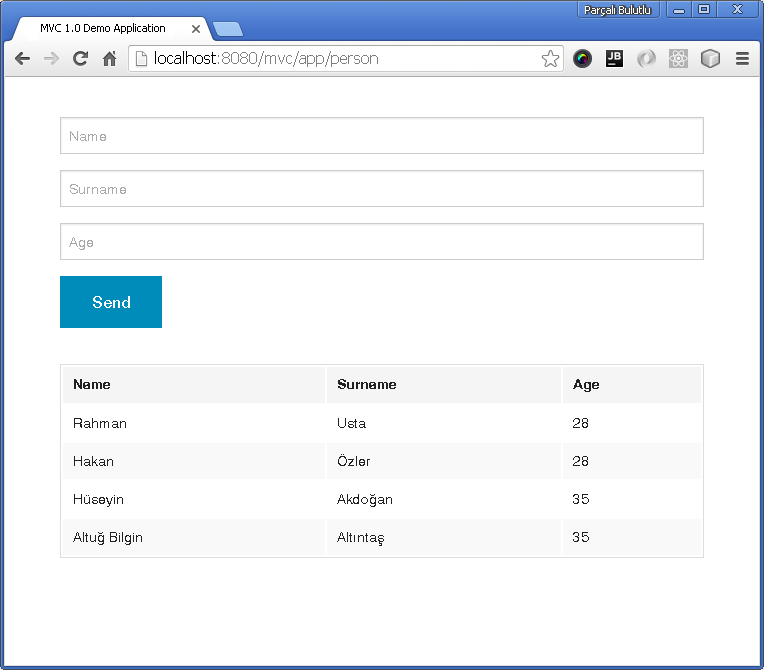

# Trabalho Final - Java MVC 1.0

Disciplina: Plataformas de Produtividade no Desenvolvimento de Software  
Aluno: Marco Túlio T. Resende  

## Tópicos

1. Descrição da Tecnologia
2. Tecnologias Relacionadas
3. Caso Real de Uso da Tecnologia
4. Livros e Sites para Aprendizado  
5. Código Mínimo que Mostre a Tecnologia em Contexto 

### 1. Descrição da Tecnologia

O Java MVC 1.0 é uma das novas especificações do Java EE 8. Diferentemente do JSF, ele foi desenhado para ser um framework action-oriented, ou seja, é um framework orientado à ações, enquanto o JSF é orientado à componentes.  

#### 1.1. Características

O modelo MVC refere-se a separação em camadas por Modelo(_Model_), Visão(_View_) e Controle(_Controller_). A camada de modelo está relacionada aos dados da aplicação, a camada de visão refere-se a apresetação dos dados da aplicação e a camada de controle é responsável por gerenciar entrada de dados, chamar regras de negócio, atualizar o modelo e delegar qual visão será exibida.  

* **Model**  

A camada de modelo do Java MVC 1.0 é basicamente um HashMap definido no pacote _javax.mvc.Models_. Normalmente, este HashMap será manipulado pelos _controllers_ para prover uma mapeamento entre nomes e objetos.  

	// MVC 1.0 - source code of javax.mvc.Models
	public interface Models extends Map<String,Object>, Iterable<String> {
	}

Além do padrão do pacote _javax.mvc.Models_, o MVC 1.0 suporta outro padrão baseado em CDI (@Named). O padrão de CDI é **recomendado** sobre o padrão _Models_, entretando, é **opcional**.

* **View**  

Os dados mantidos no _Model_ precisam ser refletidos na _View_. Para isso, a _View_ pode utilizar expressões específicas para o tipo de _View_. Por exemplo, se for retornado um objeto **Livro** que possui uma propriedade chamada **autor**, os dados serão exibidos da mesma maneira (geralmente utilizando Expression Language) de acordo com o tipo de _View_:  

> JSP view: ${livro.autor}

> Facelets view: #{livro.autor}

> Handlebars view: {{livro.autor}}

> Thymeleaf view: #{livro.autor}  

A implementação oficial do MVC 1.0 vem com vários mecanismos de _View_, sendo os principais deles o JSP e Facelets.  

* **Controller**

O _Controller_ é o cérebro da aplicação. É o responsável por combinar os _Models_ e _Views_ para atender às requisições do usuário. No MVC 1.0, os _Controllers_ são implementados no estilo JAX-RS. Entretanto, há algumas diferenças e semelhanças entre eles:  
* Um _Controller_ MVC é um recurso JAX-RS anotado com _@Controller_ (_javax.mvc.annotation.Controller_).
* A anotação _@Controller_ pose ser anotada no escopo da classe ou do método.
* Classes MVC devem utilizar somente CDI, e não classes JAX-RS nativas, EJB's, entre outras.
* Uma _String_ retornada por um _Controller_ é interpretada como um _path_ da _View_, não como conteúdo de texto. Portanto, um recurso JAX-RS pode retornar um conteúdo de texto, enquanto um _Controller_ MVC não.
* O padrão para o _media type_ é _text/html_, porém, pode ser utilizada a anotação _@Produces_, como no JAX-RS, para indicar o tipo.
* Todos os parâmetros "injetáveis" em um recurso JAX-RS, também estão disponíveis para um _Controller_ MVC.
* O ciclo de vida padrão da instância de um classe, é por requisição no JAX-RS como no MVC. Entretanto, algumas implementações podem suportar outros ciclos de vida via CDI.

##### 1.1.1. Principais Anotações

O Java MVC 1.0 traz algumas anotações, sendo elas:

* @Controller (javax.mvc.annotation.Controller): Quando aplicado a nível de classe, define um Controller MVC. Quando aplicado no método, define uma classe híbrida (controller e recurso JAX-RS).
* @View (javax.mvc.annotation.View): Quando aplicado à classe, aponta a view para todos os métodos void do controller. Quando aplicado ao método, aponta a view para este método void do controller ou para um método não void quando este retorna _null_.
* @CsrfValid (javax.mvc.annotation.CsrfValid): Somente pode ser aplicado ao nível de método e requer que um token CSRF seja validado antes da invocação do controller. Falha na validação causa _ForbiddenException_.
* RedirectScoped (javax.mvc.annotation.RedirectScoped): Pode ser aplicado a tipo, método, ou atributo; indica que um determinado bean está no escopo de redirecionamento.

#### 1.2. Java MVC 1.0 vs JSF

Ambas as tecnologias são baseadas no modelo MVC, mas com algumas diferenças:  

* Java MVC 1.0  

>	1. Action-based MVC.  
>	2. O design da página Web fica a critério do desenvolvedor.  
>	3. Processamento manual do parâmetro de request.  
>	4. A tarefa de manter as validações/conversões ficam por conta do desenvolvedor.  
>	5. Nenhum estado mantido entre as requisições.
>	6. Foco na requisição.
>	7. Suporte limitado para reúso.
	
* JSF

>	1. Component-based MVC
>	2. Componentes são renderizados pelo framework em códigos HTML/JS nas páginas Web.
>	3. Processamento automático do parâmetro de request.
>	4. Tarefa de validações/conversões tratadas pelo framework de acordo com as configurações do desenvolvedor.
>	5. Por padrão, estado é mantido sobre múltiplas requisições, mas o JSF também suporta requisições _stateless_.
>	6. Foco na página.
>	7. Componentes favorecem o reúso.

  
Fonte: [Introduction to the New MVC 1.0](http://www.developer.com/java/ent/introduction-to-the-new-mvc-1.0-ozark-ri.html "Anghel, 2016")  

### 2. Tecnologias Relacionadas  

#### 2.1. [Spring MVC](https://spring.io/ "Spring Framework") 

O Spring é um framework de aplicação de código-fonte aberto popular que pode facilitar o desenvolvimento do Java EE. Ele consiste em um contêiner, um framework para gerenciar componentes, e um conjunto de serviços de snap-in para interfaces de usuário, transações e persistência da Web. Uma parte do Spring Framework é o Spring Web MVC, um framework MVC extensível para criação de aplicações Web [NETBEANS, 2016].  
O Spring MVC é desenhado em torno de um _DispatcherServlet_ que despacha requisições para _handlers_. O _handler_ padrão é baseado nas anotações _@Controller_ e _@RequestMapping_, que oferecem uma larga flexibilidade para tratar métodos. Com a introdução da versão 3.0, o mecanismo _@Controller_ também passou a permitir a criação de sites e aplicações com RESTful, através da anotação _@PathVariable_ e outras funcionalidades.  

#### 2.2. [VRaptor](http://www.vraptor.org/pt/ "VRaptor") 

VRaptor é um framework MVC web para desenvolvimento ágil com java. Criado em 2003 no IME-USP, teve sua versão 2.0 lançada em 2005 e a versão 3.0 em 2009. Atualmente mantido pela Caelum e diversos desenvolvedores de outras empresas. Utiliza muitas idéias e boas práticas que surgiram nos últimos anos, como Convenção sobre Configuração, Injeção de Dependências e um modelo REST. É também uma iniciativa brasileira, nascida dentro da Universidade de São Paulo.  
Tudo que se precisa fazer para criar um controller do VRaptor é adicionar a anotação @Controller. A partir daí o framework já utiliza suas convenções de URLs e JSPs, exigindo o mínimo de configurações.  

#### 2.3. [Apache Struts 2](https://struts.apache.org/ "Struts")  

Apache Struts 2 é um framework de código aberto para desenvolvimento de aplicações Java EE. Ele utiliza e extende a Java Servlet API para incentivar os desenvolvedores a adotarem o modelo MVC. Algumas características do Struts 2 são:
* Plug-ins: aceita plug-ins disponibilizados por terceiros, assim, não exige que o framework venha com tudo e sim apenas as funcionalidades básicas.  
* Convenções ao invés de configurações: nomes de classes podem oferecer mapeamento de ações, e valores de resultdos retornados podem oferecer nomes para as páginas JSP serem renderizadas.  
* Anotação ao invés de configuração XML: disponibiliza anotações para serem utilizadas nas classes, reduzindo a configuração XML.  
* Conversão de dados: a conversão de valores de campos de formulários baseados em String em objetos ou tipos primitivos, é tratada pela estrutura de suporte.  
* Injeção de dependência: reduz o acoplamento entre as camadas do aplicativo, tornando-o muito mais simples.  

#### 2.4. [Apache Tapestry](http://tapestry.apache.org/ "Apache Tapestry")   

Apache Tapestry é um framework de código aberto para criação de aplicações Java dinâmicas, robustas e altamente escaláveis. O Tapestry se baseia no padrão Java Servlet API, e funciona em qualquer servlet container ou servidor de aplicação. O framework divide a aplicação Web em um conjunto de páginas, cada uma construída com componentes. Isto fornece uma estrutura consistente, onde o Tapestry assume responsabilidade pelas preocupações chaves, como construção da URL e despache, estado persistente no cliente ou servidor, validação de input do usuário, localização/internacionalização, e relatórios de exceção. O desenvolvimento de aplicações com Tapestry envolve a criação de templates HTML, e a adição de uma classe java para cada.  

#### 2.5. [Play Framework](https://www.playframework.com/ "Play Framework")  

Play é um framework de código aberto, desenvolvido na linguagem Scala e também utilizável na linguagem Java. Utiliza o padrão MVC e aumenta a produtividade utilizando o conceito de _convenção sobre configuração_. Play é baseado em uma arquitetura leve, stateless, amigável e possui como característica o consumo mínimo de recursos (CPU, memória, threads) para criar aplicações altamente escaláveis.  

### 3. Caso Real de Uso da Tecnologia  

Como a previsão para a release final da especificação do Java MVC 1.0 está prevista para 2017, não foi encontrado nenhum caso real de uso com documentação disponível na Web. Portanto, este item do trabalho não será abordado.  

### 4. Livros e Sites para Aprendizado

Ainda não existem muitos materiais disponíveis para a nova especificação. Um dos motivos é que a especificação não foi completamente finalizada. Não foram encontrados livros sobre o tema, entretanto existem alguns sites com introdução ao tema e até alguns exemplos de implementação.

* [JSR 371: Model-View-Controller (MVC 1.0) Specification](https://www.jcp.org/en/jsr/detail?id=371 "JSR 371")  

* [Ozark - Implementação de Referência para o MVC 1.0](https://ozark.java.net/ "Ozark")  

* [Caelum - Primeiros passos com a especificação do MVC 1.0](http://blog.caelum.com.br/primeiros-passos-do-mvc-1-0/ "Caelum")  

* [Introduction to the New MVC 1.0 (Ozark RI)](http://www.developer.com/java/ent/introduction-to-the-new-mvc-1.0-ozark-ri.html "Ozark RI")  

* [MVC 1.0 in Java EE 8 - How to work with Controllers](http://www.bennet-schulz.com/2015/10/javaee-mvc-controllers.html)  

* [MVC 1.0 in Java EE 8 - Getting Started with NetBeans 8.1 and Payara 4.1](https://dzone.com/articles/mvc-10-in-java-ee-8-getting-started-with-netbeans)  

* [MVC 1.0 in Java EE 8: Getting Started Using Facelets](https://itblog.inginea.eu/index.php/mvc-1-0-in-java-ee-8-getting-started-using-facelets/)  

* [Shipping MVC 1.0 into Glassfish 5](https://istanbul-jug.org/2016/03/shipping-mvc-1-0-into-glassfish-5/)

### 5. Código Mínimo que Mostre a Tecnologia em Contexto  

O código contido neste repositório foi obtido através do tutorial disponibilizado no seguinte site:  

[Shipping MVC 1.0 into Glassfish 5](https://istanbul-jug.org/2016/03/shipping-mvc-1-0-into-glassfish-5/)  

#### 5.1. Configuração  

* Baixar o Glassfish 5 nightly build no seguinte link:  

	[http://download.oracle.com/glassfish/5.0/nightly/index.html](http://download.oracle.com/glassfish/5.0/nightly/index.html)  

* Extrair o zip baixado e copiar o [javax.mvc-1.0.jar](https://github.com/rahmanusta/ozark/releases/tag/v1.0)  para o diretório $GF_HOME/glassfish/modules. Após, vá para o diretório bin pelo terminal e inicialize o Glassfish com o seguinte comando:

	asadmin start-domain  
	
* Construa o projeto utilizando o Maven no repositório do código de demonstração:

	mvn clean install  

* Será gerado um arquivo "mvc.jar" no diretório _target_. Execute o seguinte comando para realizar o deploy do demo no Glassfish:

	asadmin deploy target/mvc.war  
	
* Acesse o navegador no endereço [http://localhost:8080/mvc/app/person](http://localhost:8080/mvc/app/person) e teste a aplicação.

 

